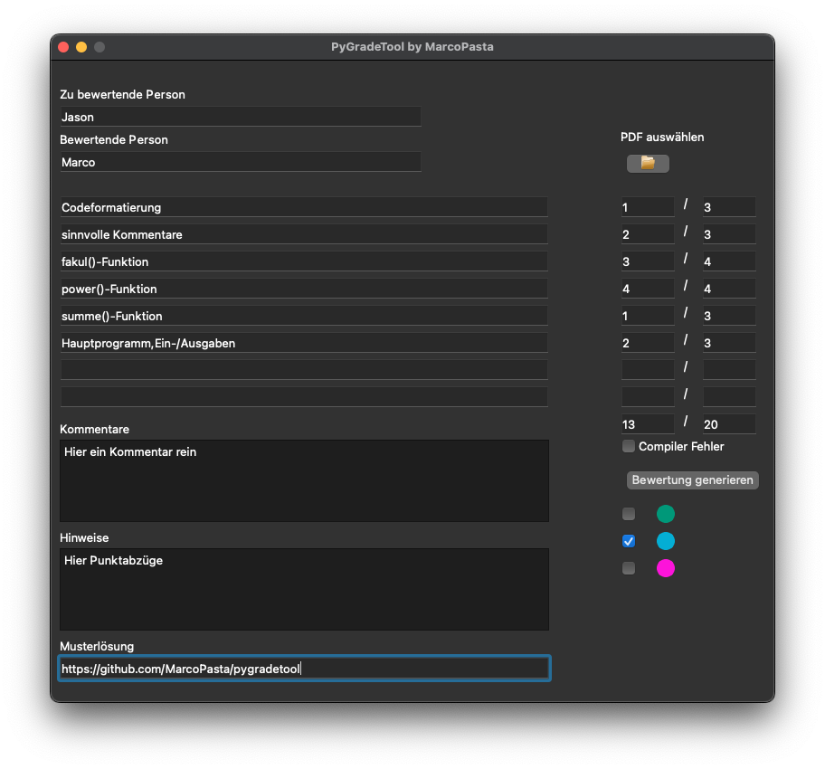
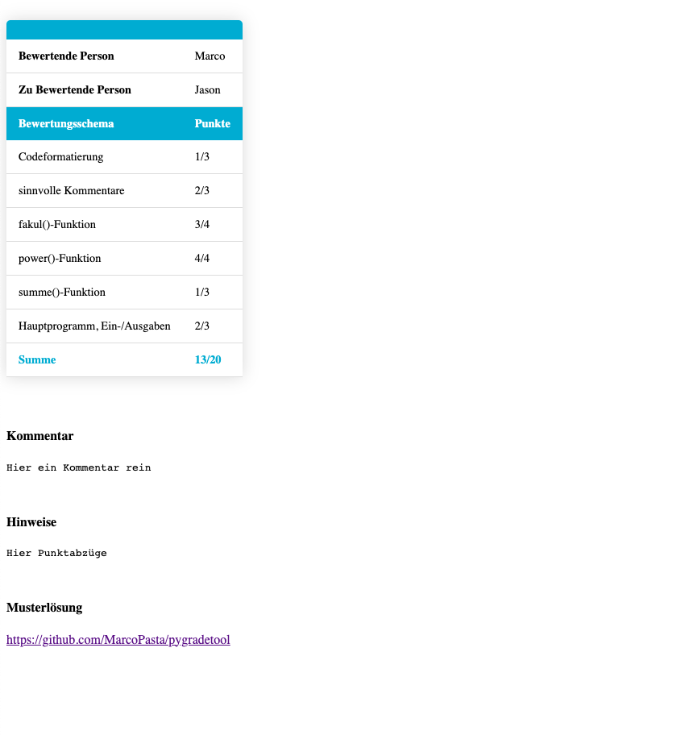

# PyGradeTool
MarcoPastas Cross-Platform PyGradeTool für die Bewertung von Studenten. Geschrieben in Python mit dem PyQt5 Framework, executables erstellt mit PyInstaller.
___
# Nutzung
Achtung! Für die Nutzung des Tools wird die Python Version 3.8 oder 3.9 empfohlen! ARM Nutzer müssen das Terminal mit Rosetta 2 kompatibilität ausführen!

Das Tool erstellt eine .html-Datei mit dem angegeben Namen + ".html". Dabei wird bei dem eingegebenen Namen das Leerzeichen gefiltert und durch ein '_' ersetzt. 

Bei der Erstellung der HTML Datei wird eine Tabelle erzeugt, welche den Namen des zu bewertenden Studenten, Name des Tutors so wie eine Tabelle mit den Kriterien. Es können bis zu maximal 8 Kriterien angegeben werden. Zu den Kriterien können ebenfalls Punkte vergeben werden aus denen die Summe der Punktzahl berechnet wird. Falls es bei dem Code zu einem Compilerfehler kommt, kann man über eine Checkbox einen Compilerfehler angeben, dadurch bekommt der Student automatisch 0 Punkte, allerdings kann er seine "potenziellen Punkte" noch einsehen. Neben den Kriterien können auch Kommentare, Hinweise sowie eine Musterlösung angegeben werden.

Um das Programm zu starten muss die im Repo enthaltene pygradetool.py mit Python gestartet werden. Wer möchte kann sich über das Package `Pyinstaller` eine executable erstellen (empfohlen für Windowsnutzer).
___
# Installation 
Bevor ihr das Tool installiert, stellt sicher das `libxcb` installiert ist
Debian & Ubuntu
```bash
sudo apt-get install libxcb-xinerama0
```

mit folgenden schritten installiert ihr das Tool: 
* `python3-venv` über den PackageManager deiner Distro installieren.
* Auf Windows ist venv bei der Installation schon dabei.
* VirtualEnvironment erstellen mit `python3 -m venv venv` Erstellt einen  Ordner mit dem Namen `venv`.
* Linux: venv betreten mit `source venv/bin/activate`.
* Windows: venv betreten mit `venv\Scripts\activate`.
* Packages nachinstallieren mit `pip install -r requirements.txt`. Hierbei werden die Packages PyQt5 und Pyinstaller installiert
* VirtualEnvironment verlassen mit `deactivate`.

Eine Executable kann wie folgt erstellt werden: 
```bash
pyinstaller --onefile --windowed --icon=icon/grade.ico pygradetool.py
```
Bei dem Fehler `missing _bootlocale`: 
```bash
--exlude-module _bootlocale
```
# Danksagung
Eine Danksagung geht raus an:
* Mr. Kinau, welcher das Template bereits in Java gecoded hat 
* LADBukkit für das finden ein paar Bugs
* ScarfedFox für das Testen und finden eines libc6 Bugs
* BlackyPurp für das helfen beim erarbeiten einer Regex Methode zur automatischen Datenextraktion der Prüfungskriterien
___
# Bilder


